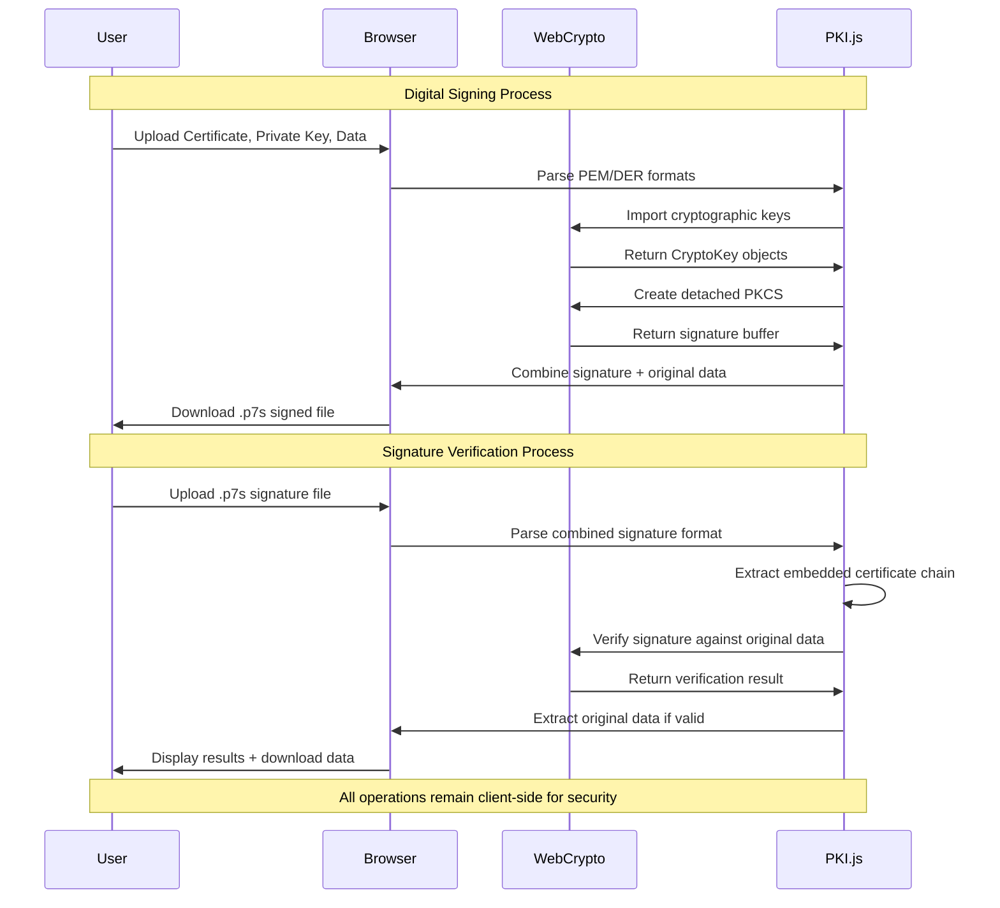
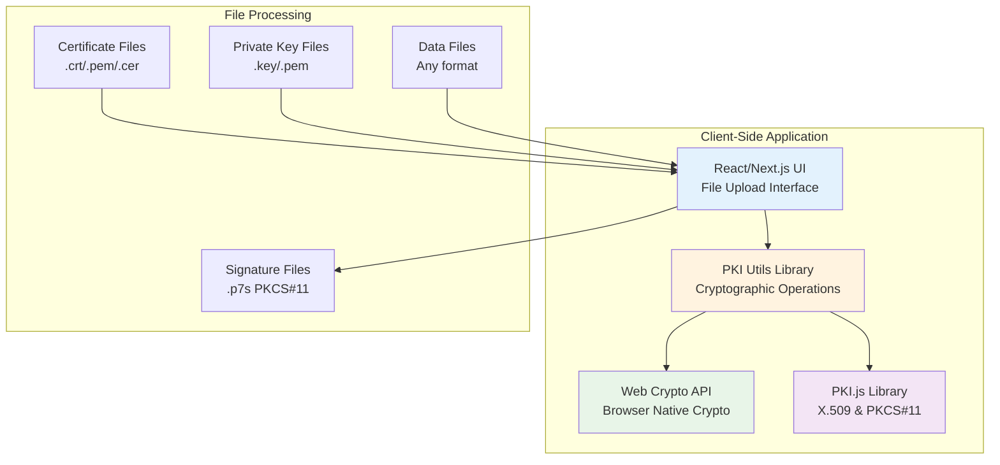
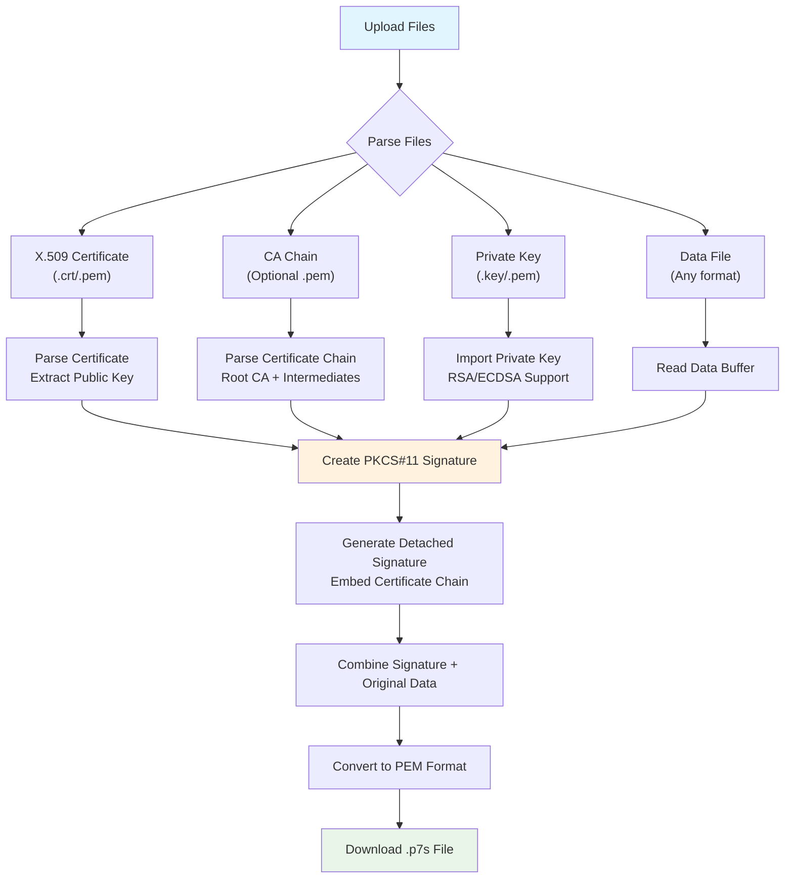
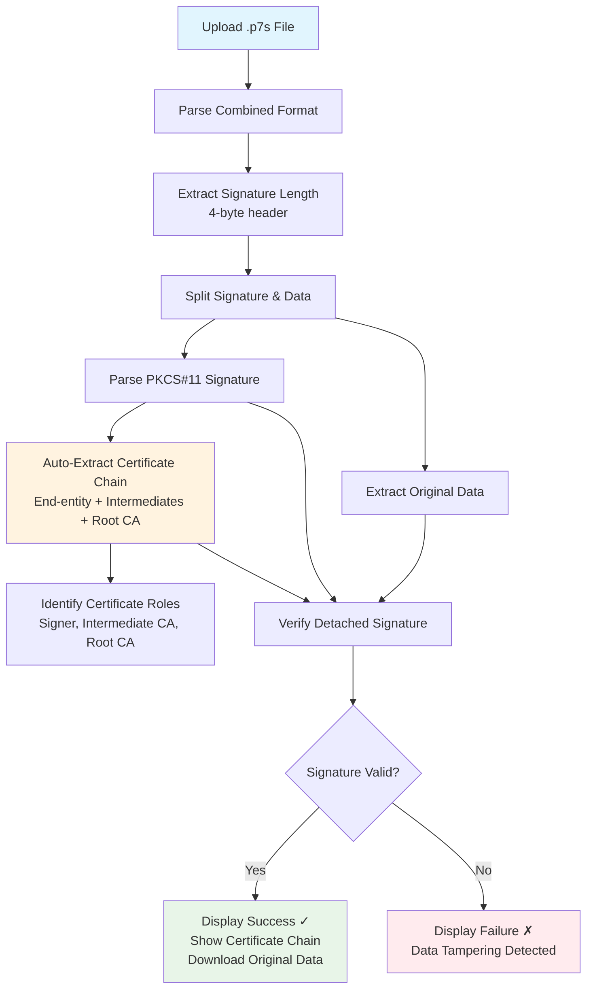
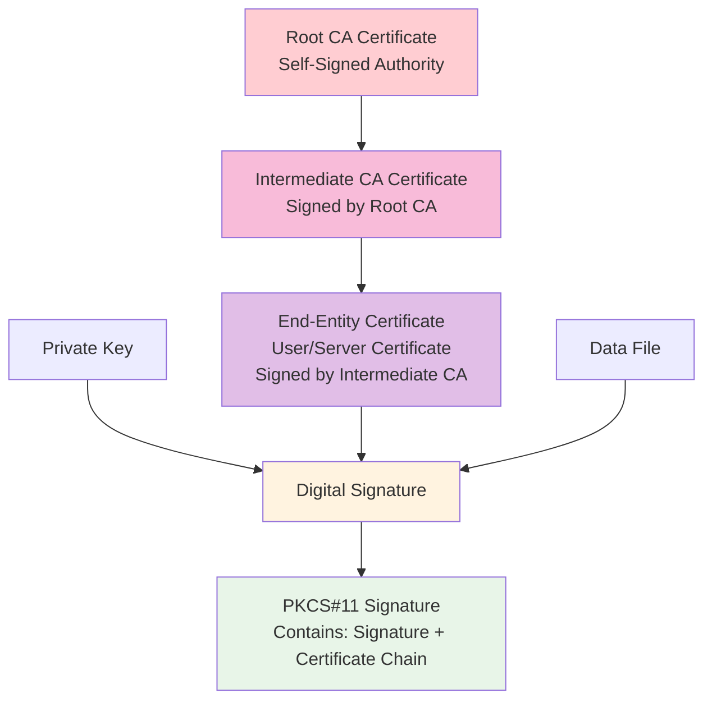

# PKI Digital Signature Tool

A web-based application for signing and verifying digital signatures using X.509 certificates and PKI.js library.

## Features

- **Certificate Management**: Upload and parse X.509 certificates (.crt, .pem, .cer)
- **CA Chain Support**: Include complete certificate chains (Root CA + Intermediate CAs) in signatures
- **Private Key Support**: Load private keys (.key, .pem) for signing operations
- **Digital Signing**: Sign any data file using PKCS#11 format with embedded certificate chains
- **Signature Verification**: Verify digital signatures with automatic certificate chain extraction
- **Certificate Chain Auto-Extraction**: No need to upload certificates for verification - extracted from .p7s files
- **Download Support**: Automatic download of signed files and extracted data
- **Modern UI**: Clean, responsive interface with dark mode support

## Getting Started

### Prerequisites

- Node.js 18+ 
- npm, yarn, pnpm, or bun

### Installation

1. Clone the repository
2. Install dependencies:

```bash
npm install
```

3. Run the development server:

```bash
npm run dev
```

4. Open [http://localhost:3000](http://localhost:3000) in your browser

### Generate Test Files (Optional)

For testing purposes, you can generate a complete PKI certificate chain and sample data:

```bash
# Make the script executable
chmod +x generate-test-files.sh

# Generate test certificates and data
./generate-test-files.sh
```

This will create a `test-files/` directory with:
- **Root CA Certificate** (`ca-certificate.pem`) - Self-signed authority
- **Intermediate CA Certificate** (`intermediate-ca-certificate.pem`) - Signed by Root CA  
- **End-Entity Certificate** (`certificate.crt`) - User/server certificate signed by Intermediate CA
- **Complete CA Chain** (`ca-chain.pem`) - Intermediate + Root CA for validation
- **Private Key** (`private-key-pkcs8.pem`) - PKCS#8 format (recommended)
- **Sample Data** (`sample-data.txt`) - ~100KB test document

### Quick Test

After generating test files:

1. **For Signing**:
   - Certificate: `test-files/certificate.crt`
   - CA Chain: `test-files/ca-chain.pem` (optional, enables full chain validation)
   - Private Key: `test-files/private-key-pkcs8.pem`
   - Data File: `test-files/sample-data.txt`

2. **For Verification**:
   - Upload the downloaded `.p7s` signature file (certificate chain auto-extracted)

### Data Flow & Security Model



## Usage

### Digital Signing

1. **Upload Certificate**: Choose your X.509 certificate file (.crt, .pem, .cer)
2. **Upload CA Chain** (Optional): Select CA certificate chain file (.pem) containing Root CA + Intermediate CAs
3. **Upload Private Key**: Select the corresponding private key file (.key, .pem)
4. **Upload Data File**: Choose any file you want to sign
5. **Click "Sign Data"**: The application will create a PKCS#11 signature with embedded certificate chain and download it automatically

### Signature Verification

1. **Upload Signed Data**: Select the .p7s signature file (certificate chain is auto-extracted)
2. **Click "Verify Signature"**: The application will verify the signature, display the certificate chain hierarchy, and extract the original data if valid

**Note**: Certificate upload is optional for verification as certificates are automatically extracted from the .p7s signature file.

## Testing Guide

### Automated Test File Generation

The project includes a comprehensive test script that generates a complete PKI infrastructure:

```bash
./generate-test-files.sh
```

**What it creates:**
- **3-tier Certificate Chain**: Root CA → Intermediate CA → End-Entity Certificate
- **RSA-2048 Key Pairs**: Industry-standard key length for testing
- **PKCS#8 Private Keys**: Compatible format for Web Crypto API
- **Large Sample Data**: ~100KB document for performance testing
- **Complete CA Chain**: Ready-to-use certificate chain file

### Testing Scenarios

#### 1. **Basic Digital Signing**
```
Certificate: test-files/certificate.crt
Private Key: test-files/private-key-pkcs8.pem
Data File: test-files/sample-data.txt
```

#### 2. **Full Chain Validation**
```
Certificate: test-files/certificate.crt
CA Chain: test-files/ca-chain.pem
Private Key: test-files/private-key-pkcs8.pem
Data File: test-files/sample-data.txt
```

#### 3. **Signature Verification**
```
Signed File: [Downloaded .p7s file from signing process]
Note: Certificate chain is automatically extracted from signature
```

### Expected Results

✅ **Successful Signing**:
- Creates `.p7s` file with embedded certificate chain
- File size: Original data + signature overhead (~2-4KB)
- Downloads automatically with `.p7s` extension

✅ **Successful Verification**:
- Displays certificate chain hierarchy (Root CA, Intermediate CA, Signer)
- Shows signature validation status
- Extracts and downloads original data
- Verifies data integrity

### Certificate Chain Details

The generated test certificates follow this hierarchy:

```
Root CA: "Test Root CA" (Self-signed, 3 years validity)
    ↓
Intermediate CA: "Test Intermediate CA" (Signed by Root, 2 years validity)  
    ↓
End-Entity: "test.example.com" (Signed by Intermediate, 1 year validity)
```

### Performance Testing

The sample data file (~100KB) is designed to test:
- Large file signing performance
- Memory usage with detached signatures
- Certificate chain processing
- Browser compatibility with substantial data

## Architecture Overview



## How It Works

### Digital Signing Workflow



### Signature Verification Workflow



### Certificate Chain Structure



## Technical Details

- **Built with**: Next.js 15, React 19, TypeScript, Tailwind CSS
- **Crypto Library**: PKI.js for X.509 and PKCS#11 operations
- **Browser Support**: Modern browsers with Web Crypto API support
- **Security**: All cryptographic operations happen client-side using Web Crypto API

## File Formats Supported

- **Certificates**: .crt, .pem, .cer (X.509 format)
- **CA Chain**: .pem (Multiple certificates in single file)
- **Private Keys**: .key, .pem (PKCS#8 format)
- **Signatures**: PKCS#11 format (.p7s files) with embedded certificate chains

## Scripts

```bash
npm run dev      # Start development server
npm run build    # Build for production
npm run start    # Start production server
npm run lint     # Run ESLint
```

## License

This project is open source and available under the MIT License.
